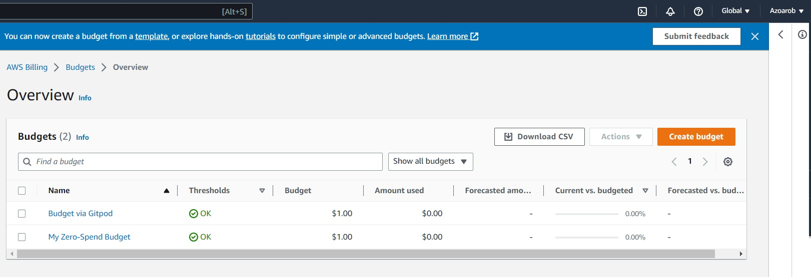

# Week 0 — Billing and Architecture

## Required Homework
### Napkin Diagram
Conceptual Diagram in Lucid Charts [link](https://lucid.app/lucidchart/1da9c505-bbbe-4984-b196-00202bf03bf9/edit?viewport_loc=-86%2C13%2C1645%2C821%2C0_0&invitationId=inv_5cf7c5e6-6ebd-47c9-b26f-aa6cddc056f1) and a screenshot:

### Logical Architectual Diagram
I have created Logical Architectual Diagram in Lucid Charts [link](https://lucid.app/lucidchart/6d9ce185-6074-404a-a81e-7539bfca0de4/edit?viewport_loc=-72%2C45%2C1765%2C881%2C0_0&invitationId=inv_d3e2094f-5f5a-42c5-bf3d-9948abefe744) and a screenshot:

### Admin user
I have created an IAM user ```Admin```. I had to rename it using CLI command 
```
aws iam update-user --user-name main_user --new-user-name Admin
```


### Enable Billing
I have enabled recieving billing alerts

### Creating a Billing Alarm
I have created SNS topic as it's been added to [aws/json](https://github.com/azoarob/aws-bootcamp-cruddur-2023/tree/main/aws/json) folder and subscribed it to a new subscription. Also created billing alarm 


### AWS Budget
I have created two budgets, one via console and the other one via CLI

