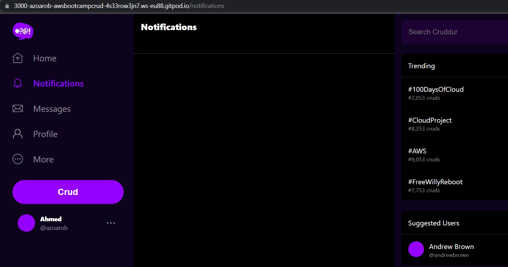
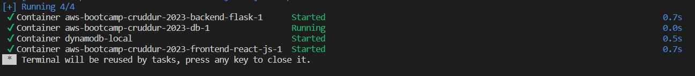

# Week 1 — App Containerization

## Required Homework
### Containerize Backend
- Added Dockerfile for the Backend flask
- Built Container
- Ran Container


### Containerize Frontend
- Created Docker File the Frontend react
- Built Container
- Ran Container


### Multiple Containers
Created a docker-compose file and ran it successfully.
It contains Backend and frontend docker files. Also both local DynamoDB and Postgres were created and ran successfully. 



### Push and tag an image to DockerHub
- I have created a profile in Dockerhub
- Signed in to my dockerhub profile using **docker login**

-Tagged the immage using
```
docker tag aws-bootcamp-cruddur-2023-backend-flask\ 
azorob/ aws-bootcamp-cruddur-2023-backend-flask
```
- Pushed the tagged image to dockerhub profile using
```
docker push azorob/aws-bootcamp-cruddur-2023-backend-flask
```
- Checked my profile and it showed up as shown 


